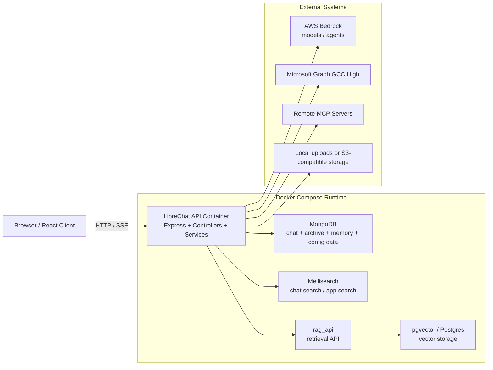
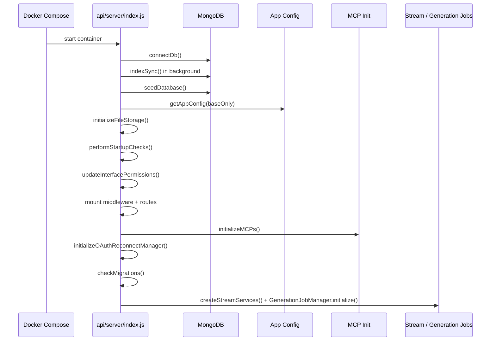
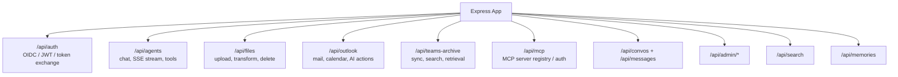
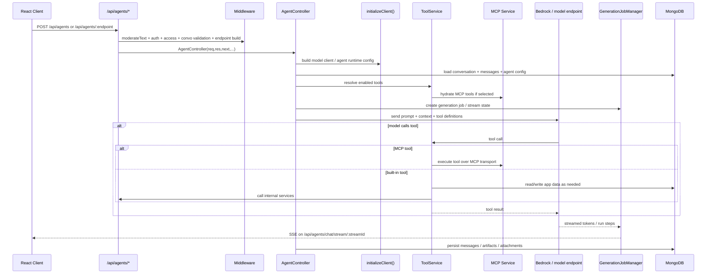
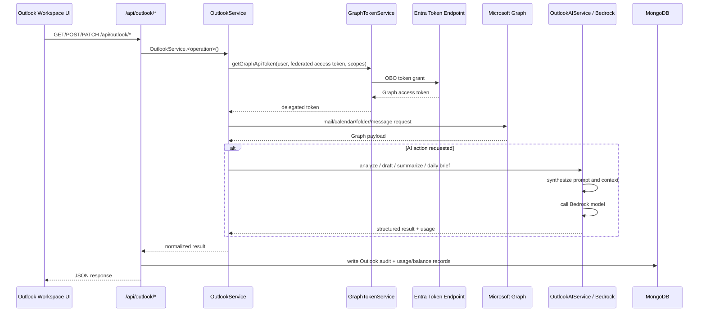
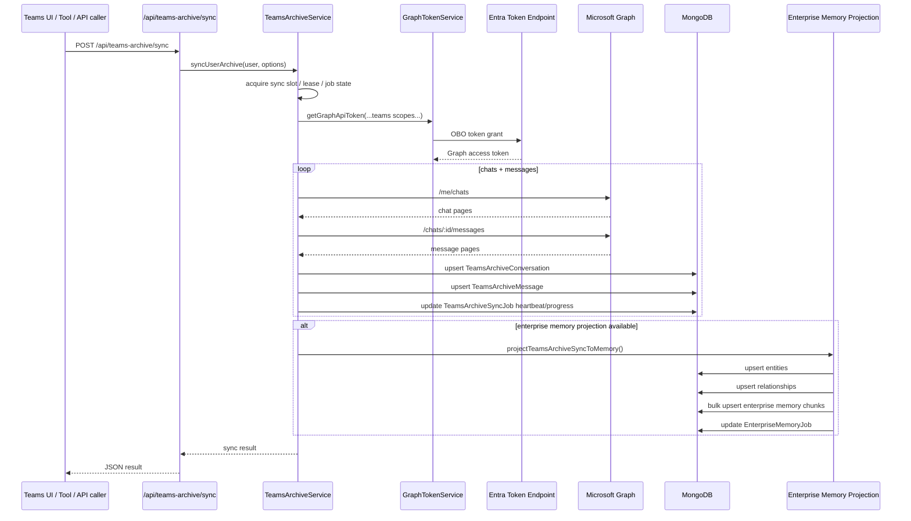
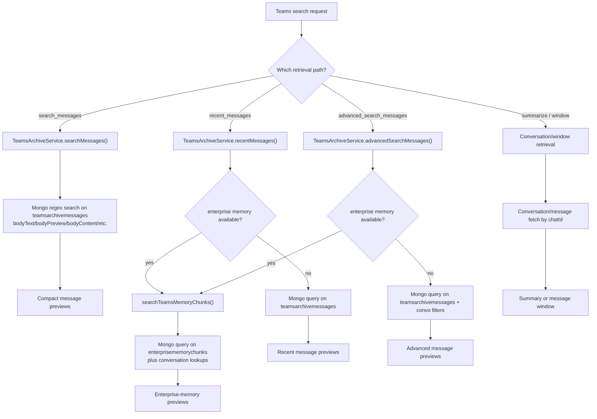
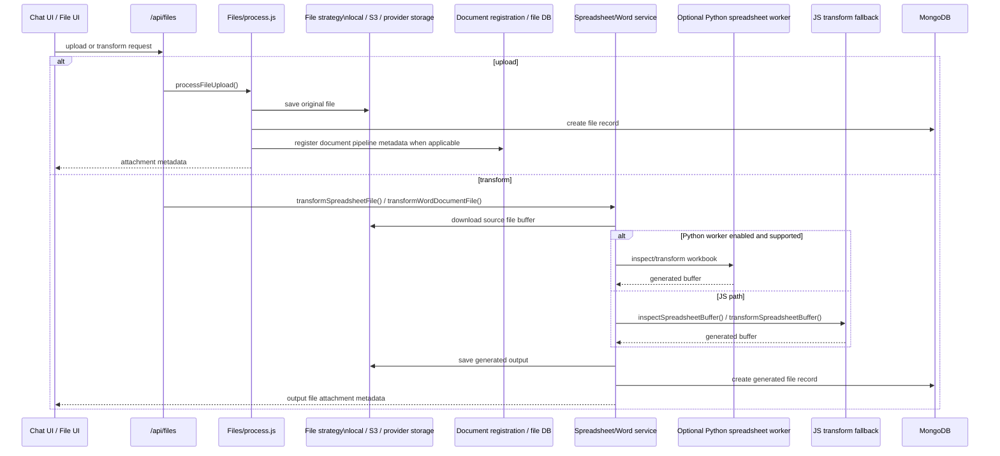
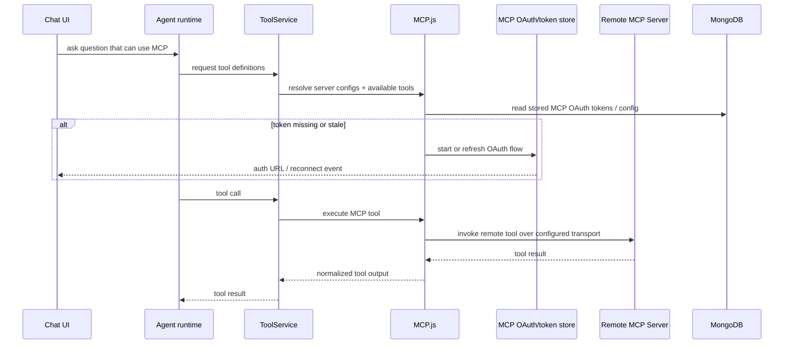
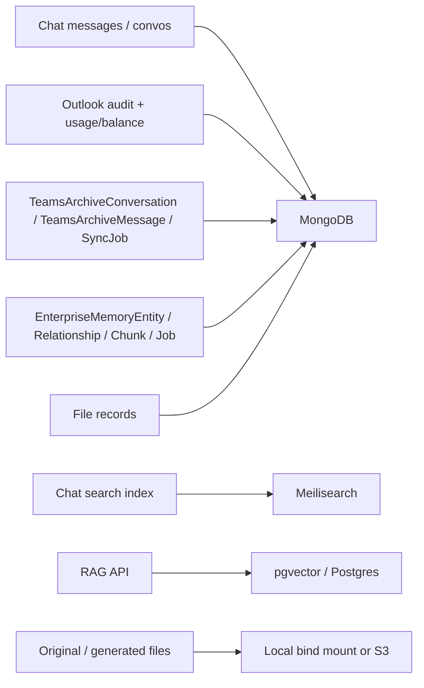

F3# Low-Level App Call Diagram

Last updated: 2026-05-16

## Purpose

This document is a review aid for the current LibreChat fork. It focuses on low-level call paths rather than product features so changes can be traced from UI action to backend route, service layer, external dependency, and persistence layer.

It reflects the current repo state, including custom Outlook, Teams archive, enterprise memory, MCP, and document-processing work.

## Runtime Topology

## Server Boot Path

## Main API Surface

## Chat / Agent Generation Path

This is the main call path when a user sends a normal chat or agent message.

### Notes

- Streaming is stateful through `GenerationJobManager`, not just raw one-shot HTTP responses.
- Tool resolution is dynamic and includes built-in tools, file tools, web/image tools, action tools, and MCP tools.
- MCP auth and reconnection logic are centralized in the server, not the browser.

## Outlook Call Path

Outlook uses delegated Entra auth with OBO token exchange before every Graph access path that needs a downstream token.

### Current implementation details

- OBO is centralized in `GraphTokenService`.
- Outlook route handlers are thin wrappers around `OutlookService`.
- AI actions record usage and audit separately from raw Graph access.
- The read/unread update path now writes to Graph directly rather than waiting for a passive refresh.

## Teams Archive Sync Path

This is the ingestion path that builds the archive and then projects it into enterprise memory.

### What the slow Mongo logs mean

- Slow `update` operations on `enterprisememorychunks` are expected during projection because the current projection path bulk-upserts chunk records after sync.
- Those are write-heavy projection operations, not user search operations.

## Teams Search Split: Archive Regex vs Enterprise Memory

This is the most important current review detail because the product behavior can look similar while the backend path is very different.

### Current status from logs

- The logs showing `COLLSCAN` on `teamsarchivemessages` with regex filters are evidence of the archive-message fallback/search path still being exercised.
- If the user experience improved without a clearly visible explicit advanced-search tool call, the likely reason is one of:
  - the agent is choosing a better Teams action mix even without naming it clearly
  - some requests are using enterprise-memory retrieval while others are still using archive regex search
  - summarized/conversation-bounded retrieval is improving answer quality after the initial search

## File Upload and Transform Path

This is the path behind document/spreadsheet processing and generated file attachments.

### Current implementation details

- The spreadsheet service chooses between Python worker and JS fallback per file.
- Generated files are now re-registered into the live tool/file context so chained transforms can target the newly created file in the same run.
- Agent callback handling now defers intermediate file artifacts so only the final transform output is surfaced back to the user during a chained run.

## MCP Tool Path

## Persistence Map

## Review Hotspots

If you need to audit changes quickly, these are the best places to start:

1. `api/server/index.js`
   This is the real server boot graph and route mount map.

2. `api/server/routes/agents/*` and `api/server/services/ToolService.js`
   This is the core chat/tool orchestration path.

3. `api/server/services/GraphTokenService.js`
   This is the shared OBO choke point for Outlook, Teams, and SharePoint-style delegated Graph access.

4. `api/server/services/OutlookService.js` and `api/server/routes/outlook.js`
   This is the main enterprise workspace integration path.

5. `api/server/services/TeamsArchiveService.js`
   This is the archive ingestion, basic search, advanced search fallback, and summary path.

6. `api/server/services/EnterpriseMemory/*`
   This is the new cross-source retrieval layer and the source of `enterprisememorychunks` write load.

7. `api/server/services/Files/Spreadsheets/*`, `api/server/services/Files/WordDocuments/*`, and `api/server/routes/files/files.js`
   This is the document transformation platform and generated-file return path.

## Current Caveats

- Teams basic search still uses regex scans against `teamsarchivemessages` and can show `COLLSCAN` in Mongo logs.
- Enterprise memory improves retrieval quality, but it also adds significant write load during sync because chunks are bulk-upserted.
- Outlook, Teams, and SharePoint-style picker flows all rely on the same OBO token-exchange pattern; auth regressions in that area can affect multiple product surfaces.
- The document platform now has multiple execution paths: upload pipeline, JS transform path, optional Python spreadsheet worker path, and agent callback attachment handling. That is the correct direction, but it means file-workflow regressions need end-to-end testing rather than route-only testing.

